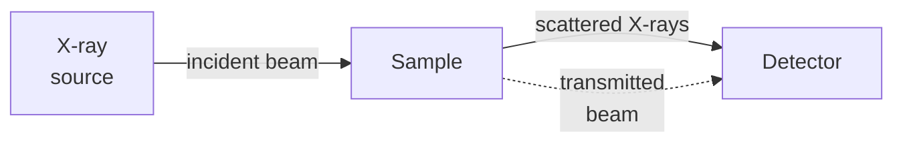

# What is SAXS?

**Small-angle X-ray scattering** (SAXS) is a technique for measuring the structure of
materials at length scales between roughly 1 and 100 nanometers — the scale of proteins,
lipid vesicles, nanoparticles, and polymer chains. Rather than imaging a structure
directly, SAXS measures how a beam of X-rays is deflected when it passes through a
sample. The pattern of deflected intensities carries a fingerprint of the underlying
structure, and our job is to decode it.

## The experiment

A SAXS measurement involves three components:

X-rays from the source pass through the sample. Most of them continue in a straight
line (the transmitted beam, which is blocked by a beamstop). A small fraction are
scattered — deflected at angles that depend on the size and arrangement of structures
in the sample. The detector records the intensity of these scattered X-rays as a
function of angle.

## The scattering vector q

Rather than working directly with the scattering angle $2\theta$, we use the
**scattering vector** $q$. It combines the angle and the X-ray wavelength $\lambda$
into a single quantity with units of inverse length:

$$q = \frac{4\pi}{\lambda}\sin\theta$$

where $2\theta$ is the angle between the transmitted beam and the scattered beam, and
$\lambda$ is the wavelength of the X-rays.

!!! note "Key Concept: What q measures"
    $q$ has units of inverse length (in this tutorial, Å$^{-1}$). It is a spatial
    frequency — large $q$ corresponds to small length scales, and small $q$ corresponds
    to large length scales. A rough rule of thumb is that a feature of size $d$ produces
    a signature at $q \approx 2\pi / d$.

    Typical SAXS measurements cover $q$ from about $0.001$ to $1$ Å$^{-1}$, which
    corresponds to length scales from roughly $6$ to $6000$ Å.

## What we measure: I(q)

The detector records the **scattering intensity** $I(q)$ — how much X-ray signal
arrives at each value of $q$. Because samples are usually isotropic (the same in every
direction), the two-dimensional detector image is averaged into a one-dimensional
$I(q)$ curve. This curve is what we compute, fit, and interpret.

## Form factor and structure factor

The intensity $I(q)$ has two contributions:

- The **form factor** $P(q)$ encodes the shape and size of individual particles.
- The **structure factor** $S(q)$ encodes how those particles are arranged relative
  to each other — whether they are randomly distributed, packed closely, or ordered.

In this tutorial we will always assume the sample is **dilute**: particles are far
apart and do not interact. Under that assumption $S(q) = 1$, and the intensity
simplifies to:

$$I(q) \propto N \, (\Delta\rho)^2 \, V^2 \, P(q)$$

where $N$ is the number of particles, $\Delta\rho$ is the contrast between the particle
and the surrounding medium (introduced on the next page), and $V$ is the particle
volume. Structure factors for concentrated systems will be covered in a later section.

!!! tip "Units in this tutorial"
    All scattering vectors in this tutorial are in **Å$^{-1}$** (inverse angstroms).
    You will also encounter **nm$^{-1}$** (inverse nanometers) in the literature —
    the conversion is $1 \text{ nm}^{-1} = 0.1 \text{ Å}^{-1}$. Mixing units is one
    of the most common sources of errors in scattering calculations, so always check
    which convention a paper is using before comparing numbers.

---

**What's next:** [Scattering Length Density](2-scattering-length-density.md) — the
material property that determines how strongly a particle scatters X-rays.
